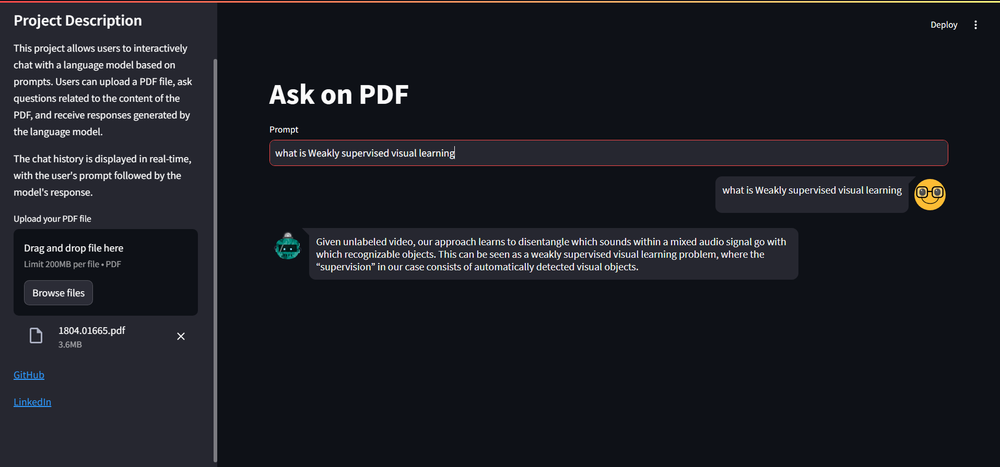

Sure, here's a draft for your README file:

---

# AskPDF

AskPDF is a web application built using Streamlit, allowing users to upload a PDF file and ask questions on its content. The application leverages Google's Generative AI and FAISS for question answering capabilities.



## Installation

1. Obtain a Google API key by visiting [Google's AI Studio](https://aistudio.google.com/app/apikey).
2. Create a file named `.env` in the project directory and add your Google API key as `GOOGLE_API_KEY=your_api_key_here`.
3. Clone this repository to your local machine:
   ```bash
   git clone https://github.com/your_username/AskPDF.git
   ```
4. Navigate to the project directory:
   ```bash
   cd AskPDF
   ```
5. Install the required dependencies:
   ```bash
   pip install -r requirements.txt
   ```

## Usage

To run the application, execute the following command:
```bash
streamlit run main.py
```

Once the application is running, open your web browser and navigate to the provided URL (usually http://localhost:8501) to access AskPDF.